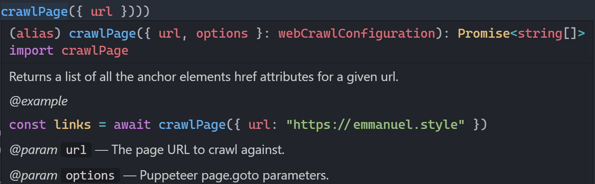

# DeepCrawl take-home task

## 🧾Requirements

1. Crawl should be limited to one domain address.
2. Crawled page URLs should be fetchable either using a query or subscription.
3. URLs could be used for building sitemaps.
4. Crawling multiple pages should run in parallel.

### 📚 Stories

1. As a user, I want to be able to start a crawl for my website, so that I would be able to generate a sitemap.
2. As a user, I want to be able to limit the speed of the crawl. So that I would not take down my website.
3. As a user, I want to be able to monitor my crawl using GraphQL subscriptions, what URLs it is crawling at the moment and how many he crawled total.
4. As a user, I want to be able to fetch a paginated list of URLs found, to be able to generate sitemap using the API.

## 👩‍💻Technology choices

**We'll leverage mostyl native JavaScript functionalities to implements this crawler.**

**We'll also use the following runtime libraries :**

-   [Puppeteer](https://github.com/puppeteer/puppeteer) (Page rendering)

    -   We're using a headless puppeteer to render pages before the crawler runs, in order to handle SPA/JavaScript rendered pages.
    -   Even though pupeteer is a node dependency, you might have to manually install some libs like libxss1. Refer to their documentation if needed.

-   [Apollo Server Fastify](https://github.com/apollographql/apollo-server/blob/main/packages/apollo-server-fastify/README.md) (GraphQL Server)

    -   We're using Fastify over Express as it gives way better performances 🚀 The adoption is increasing, and the [ecosystem](https://www.fastify.io/ecosystem/) is maturing.
    -   Fastify v3 doesn't work with Apollo [yet](https://github.com/apollographql/apollo-server/pull/4356) 😥, so we're using v2
    -   We'll use the in-memory PubSub for our websocket implementation, which is fine for this PoC.
    -   Fastify already uses Pino for logging, and out of the box it can accept a custom pino instance if needed.

-   [Nexus Schema](https://github.com/graphql-nexus/schema) (GraphQL schema building)

    -   In order to build our schema we'll use `@nexus/schema`.
    -   It is an interesting alternative to type-graphql. It is more recent and you can find an article that compares [both here](https://novvum.io/post/typegraphql-and-graphql-nexus-a-look-at-code-first-apis/).
    -   The way nexus/schema works is closer to the way graphql.js works, while giving full Typescript support. `nexus:generate` will generate the schema.graphql and the typescript types at once.
    -   Having used both, I personnally think they're both good and production ready. While type-graphql has a better documentation and is more popular, I find nexus/schema more flexible and readable, and more pleasant to work with.

-   [Threads.js](https://github.com/andywer/threads.js) (Multi-threading)
    -   In order to implement the 4th requirement, we'll leverage threads.js, which has a syntax closer to the WebWorker API while using `worker_threads` under the hood (when supported).
    -   By adding a `ts-node` dependency we can write our Worker in typescript without configuring anything.

## 🔬 How to use

**It is recommended that you clone the repository and use an IDE with Typescript support (like VSCode) to review the code. Thanks to [type inference and contextual typings](https://www.typescriptlang.org/docs/handbook/type-inference.html), Typescript provides us with a lot of information. For example most of the return types are inferred and aren't specified in the JSdocs or written out. Functional Programming ❤**

**That's how it should looks in VSCode :**


-   Tested with Node 14+ and yarn
-   The `yarn nexus:generate` script needs to run to generate Typescript types and the graphQL schema. It runs by default as a postinstall script.
-   All the tests are in the tests directory, use `yarn test` to run everything.
-   Static documenation is available with `yarn docs`. This is generated directly from the schema.graphql.
-   The graphQL playground is available using `yarn dev`.
-   The entry point is `src/server.ts`
-   The source code will be extensively documented to explain the reasoning behind most choices.

_Types troubleshoot: If some of the nexus related types are not working, try to run `yarn nexus:generate`, restart the TS Server, and restart your IDE._

> CLI instructions

```bash
# Install the dependencies, this will run `nexus-generate`
yarn

# Run the test suite. Note that the services.test.ts can fail
# if your system doesn't have the necessary libs to run puppeteer.
# If that happens you  probably needs to run something like
# `apt install libss1` (depends on your OS).
yarn test

# Start the dev server. Note that this uses nodemon,
# So the in memory stuff isn't lost when you add/edit the source code.
yarn dev

#You can now play with the playground 🎉🎉🎉

# This serve the static documentation
yarn docs

# If you want to build and run with node :
yarn build && node dist/server.js
```
